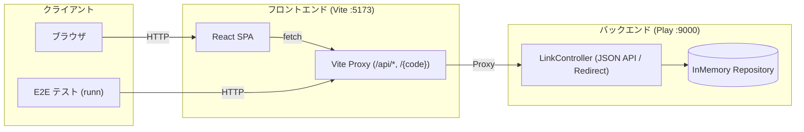

# short-link-service

URL を短縮し、短縮 URL から元の URL へのリダイレクトおよび復元を行う Web サービスです。

## 目次

- [サービス要件](#サービス要件)
- [システム構成とドキュメント](#システム構成とドキュメント)
- [デプロイ済みの環境](#デプロイ済みの環境)
- [クイックスタート](#クイックスタート)

---

## サービス要件

本サービスは以下の要件に基づいて実装されています。

- **URL 短縮**: 元 URL を短い URL に変換する。
- **URL 復元**: 短縮 URL を入力して元 URL を取得する。
- **リダイレクト**: 短縮 URL へのアクセスを元 URL へ 302 リダイレクトする。
- **同一 URL の同一コード返却**: 同じ元 URL が指定された場合は、常に同じ短縮 URL を返す（重複登録しない）。
- **データ永続化不要**: リンクデータはインメモリで管理（サービス停止・再起動で消えてよい）。
- **短縮 URL のドメイン**: `https://example.com/`。
- **短縮コードの形式**: ランダムな英数字 8 文字（例: `https://www.example.org/` → `https://example.com/Xk3pR8vN`）。

---

## システム構成とドキュメント

本リポジトリは、フロントエンド、バックエンド API サーバ、および E2E テストシナリオで構成されています。それぞれの詳細な仕様や開発手順、設計方針は各ドキュメントを参照してください。



| 対象                         | ドキュメント                                                       | 役割と技術スタック                                                                                                                  |
| ---------------------------- | ------------------------------------------------------------------ | ----------------------------------------------------------------------------------------------------------------------------------- |
| **API サーバ**               | [src/server/README.md](src/server/README.md)                       | Scala 3.3.6 + Play Framework 3.0.11 (sbt 1.13.0)、JDK 21。JSON API 専用。HTTP API 仕様、コアドメインロジック、ログ設計、ScalaTest。 |
| **画面**                     | [src/front/README.md](src/front/README.md)                         | React 19 + TypeScript 7 + Vite 8 (Bun)。ログイン不要の 1 画面 SPA。Vite プロキシ設定、画面仕様、クライアントバリデーション。        |
| **E2E テスト**               | [tests/README.md](tests/README.md)                                 | [runn](https://github.com/k1LoW/runn) (YAML runbook)。実際に起動したサービスに対する外側からの結合・疎通テストシナリオ。            |
| **開発環境ガイド**           | [docs/development.md](docs/development.md)                         | Docker Compose やローカル直接起動の手順、ホットリロード、環境変数、Devcontainer の詳細設定。                                        |
| **運用・本番アーキテクチャ** | [docs/production-architecture.md](docs/production-architecture.md) | 単一プロセス制約（インメモリ保持）、本番構成 (Cloudflare Worker + Tunnel + ECS on Fargate)、CI / CD、リリース・E2E・destroy の手順。 |
| **開発規約・設計方針**       | [docs/conventions.md](docs/conventions.md)                         | コメント・ドキュメントの言語方針、例外不使用のエラーハンドリング、情報保護、ロギング規約。                                          |

---

## デプロイ済みの環境

> **このサービスは停止しています (2026-09-25)。** 3 環境とも AWS の ECS と Cloudflare の Worker / Tunnel / Access を削除したので、下の URL にはつながりません。下の表は稼働していたときの記録です。作り直す手順は [docs/production-architecture.md](docs/production-architecture.md) を参照してください。

| 環境    | URL                                                    | 出すきっかけ                     | 公開範囲                         | 短縮 URL のドメイン          |
| ------- | ------------------------------------------------------ | -------------------------------- | -------------------------------- | ---------------------------- |
| develop | `https://s-dev.u-na-gi.com`                            | `develop` ブランチへの push      | Cloudflare Access でログイン必須 | `https://example.com` (要件) |
| staging | `https://s-stg.u-na-gi.com`                            | `main` ブランチへの push         | Cloudflare Access でログイン必須 | サイトと同じ                 |
| prod    | `https://s.u-na-gi.com`                                | `v*` タグ (オーナーの承認が必要) | 公開                             | サイトと同じ                 |

- develop が発行する短縮 URL (`https://example.com/xxxxxxxx`) は直接は開けません。サイトの復元フォームで元の URL に戻します。
- ホスト名は `infra/terraform/envs/<env>/main.tf` の `hostname` と `src/front/wrangler.jsonc` の `routes` の 2 か所にあり、揃えておく必要があります (deploy 時に検査)。短縮 URL のドメインは `infra/terraform/envs/<env>` の output `shortener_base_url` です。

---

## クイックスタート

Docker Compose を使用して開発環境を起動します。

```sh
# 1. 環境変数の設定 (初回のみ)
cp .env.example .env

# 2. 開発環境の起動
make up

# 3. ログの確認
make logs-server   # server の JSON ログを jq で整形表示

# 4. 停止
make down
```

- **フロントエンド画面**: [http://localhost:5173](http://localhost:5173)
- **API サーバ (Play)**: [http://localhost:9000](http://localhost:9000)

> [!NOTE]
> 初回起動時、Play Framework のコンパイルにより最初のリクエストへの応答に数分かかる場合があります。
> 詳細な開発環境のセットアップやホスト上での直接起動手順については、[docs/development.md](docs/development.md) を参照してください。
