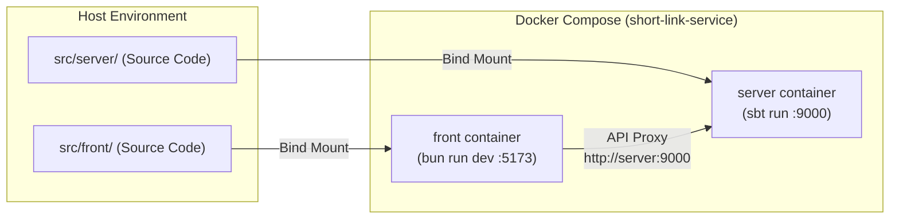

# Development Environment Guide (`docs/development.md`)

This document describes the setup, startup/shutdown procedures, log inspection methods, and development precautions for this project's development environment.

## Table of Contents

- [Prerequisites](#prerequisites)
- [Development with Docker Compose (Recommended)](#development-with-docker-compose-recommended)
  - [Quickstart](#quickstart)
  - [Makefile Command Reference](#makefile-command-reference)
  - [Container Architecture and How It Works](#container-architecture-and-how-it-works)
- [Running Directly on the Host (Without Docker)](#running-directly-on-the-host-without-docker)
  - [1. Starting the Backend](#1-starting-the-backend)
  - [2. Starting the Frontend](#2-starting-the-frontend)
  - [Behavior When Running Directly](#behavior-when-running-directly)
- [Configuration and Environment Variables](#configuration-and-environment-variables)
- [Development with VS Code Dev Containers](#development-with-vs-code-dev-containers)

---

## Prerequisites

- [Docker](https://www.docker.com/) and Docker Compose
- `make`
- (Only when running directly outside containers)
  - JDK 21
  - sbt 1.13.0
  - [Bun](https://bun.sh/) 1.4+

---

## Development with Docker Compose (Recommended)

This repository provides an environment where the frontend and backend can be started with a single command using `compose.yaml` and `Makefile`.

### Quickstart

Run the following steps at the repository root.

```sh
# 1. Prepare environment variable file (first time only)
cp .env.example .env

# 2. Build and start development environment
make up

# 3. View logs
make logs          # View logs for all services
make logs-server   # Format and stream server JSON logs with jq

# 4. Stop development environment
make down
```

Access endpoints after startup:

- **Frontend UI**: [http://localhost:5173](http://localhost:5173)
- **Backend API (Play)**: [http://localhost:9000](http://localhost:9000)

### Makefile Command Reference

| Command | Execution | Description |
| --- | --- | --- |
| `make up` | `docker compose up -d --build --renew-anon-volumes` | Builds and starts containers in the background. Recreates anonymous volumes so stale `node_modules` are not left behind when `package.json` changes. |
| `make down` | `docker compose down` | Stops and removes running containers. |
| `make logs` | `docker compose logs -f` | Streams logs for all services in real time. |
| `make logs-server` | `docker compose logs -f --no-log-prefix server \| jq -R 'fromjson? // .'` | Formats and displays server stdout logs (JSON) using `jq` for readability. |
| `make e2e` | (Described below) | Launches E2E-dedicated Compose and automatically cleans up after tests finish. See [tests/README.md](../tests/README.md) for details. |

### Container Architecture and How It Works



1. **Hot reload (HMR)**:
   - Host-side source code (`src/server`, `src/front`) is bind-mounted into containers.
   - There is no need to enter containers to work; saving code in your host editor immediately reflects changes via `sbt run` and Vite hot reload.
2. **Notes on initial startup**:
   - Play Framework dev mode compiles source code when it receives the first request. Therefore, access immediately after initial startup may take a few minutes before responding.
3. **Separation of build artifacts and cache**:
   - `target/` and `project/target/` are isolated in a named volume (`server-target`) to prevent conflicts with Devcontainer or host-side Metals/sbt.
   - Caches for sbt and coursier are also volume-mounted, avoiding re-downloading dependency libraries on every container restart.
4. **Retaining standard input (`stdin_open: true`, `tty: true`)**:
   - Because `sbt run` stops when stdin is closed (treating it as pressing Enter), tty and stdin are kept open in the Compose definition.

---

## Running Directly on the Host (Without Docker)

It is also possible to run each process directly in terminals on the host machine without Docker.

### 1. Starting the Backend

```sh
cd src/server
sbt run
```

Play Framework starts on port `9000`.

### 2. Starting the Frontend

Open another terminal and run:

```sh
cd src/front
bun install
bun run dev
```

Vite dev server starts on port `5173`.

### Behavior When Running Directly

- The Vite proxy points to `http://localhost:9000` by default (to change the proxy target, run `API_ORIGIN=http://host:port bun run dev`).
- **Testing short URLs by clicking**: Since the default value of `shortener.base-url` in the backend is `http://localhost:5173`, when running directly you can test redirection by clicking the issued short URL (`http://localhost:5173/xxxxxxxx`) directly in a browser.
- When running under Docker Compose, `SHORTENER_BASE_URL=https://example.com/` is passed via `.env`, so issued short URLs cannot be opened directly locally (as per specification requirements).

---

## Configuration and Environment Variables

When starting Compose, environment variables are passed to the server container from `.env` in the root directory.

| Environment Variable | Default (`conf/application.conf`) | Value in .env.example | Description |
| --- | --- | --- | --- |
| `SHORTENER_BASE_URL` | `http://localhost:5173` | `https://example.com/` | Base URL for short URLs. Specifies the public domain for production or verification. |
| `PLAY_EXTRA_ALLOWED_HOST` | (Unset) | `server` (in compose.yaml) | Hostname to add to Play's `play.filters.hosts.allowed`. Required in Compose because the Vite proxy rewrites the Host header to `server:9000` when forwarding requests. |
| `SBT_OPTS` | (Unset) | `-Dsbt.supershell=false -Dsbt.color=false` (in compose.yaml) | Prevents sbt progress bars and color escape codes from mixing into JSON logs and causing `jq` parsing failures. |

---

## Development with VS Code Dev Containers

This repository provides `.devcontainer/`. Opening in VS Code and selecting "Reopen in Container" provides a development environment with all required toolchains.

- **Included environment**: Debian trixie, JDK 21, sbt 1.13.0, Bun, Node LTS, runn 1.11.0, gh, jq, make, Metals MCP.
- **Docker-outside-of-Docker**:
  - Uses the host Docker daemon directly from within the Devcontainer.
  - Even when running `make up` or `make e2e` from inside the Devcontainer, the host absolute path (`LOCAL_WORKSPACE_FOLDER`) is obtained via `remoteEnv` in `devcontainer.json` and correctly passed to Compose bind mount sources.
- **Metals recognition**:
  - Uses VS Code multi-root workspace file `short-link-service.code-workspace`. Placed `src/server` at the top of the workspace so Metals correctly detects the build root.
