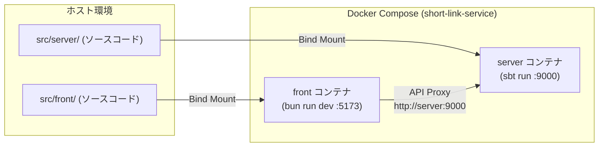

# 開発環境ガイド (`docs/development.md`)

本プロジェクトの開発環境のセットアップ、起動・停止手順、ログの確認方法、および開発時の注意点について説明します。

## 目次

- [前提条件](#前提条件)
- [Docker Compose による開発 (推奨)](#docker-compose-による開発-推奨)
  - [クイックスタート](#クイックスタート)
  - [Makefile コマンドリファレンス](#makefile-コマンドリファレンス)
  - [コンテナ構成と動作の仕組み](#コンテナ構成と動作の仕組み)
- [ローカル直接起動 (Docker を使わない場合)](#ローカル直接起動-docker-を使わない場合)
  - [1. バックエンドの起動](#1-バックエンドの起動)
  - [2. フロントエンドの起動](#2-フロントエンドの起動)
  - [直接起動時の挙動](#直接起動時の挙動)
- [設定と環境変数](#設定と環境変数)
- [VS Code Devcontainer での開発](#vs-code-devcontainer-での開発)

---

## 前提条件

- [Docker](https://www.docker.com/) および Docker Compose
- `make`
- (コンテナ外で直接動かす場合のみ)
  - JDK 21
  - sbt 1.13.0
  - [Bun](https://bun.sh/) 1.4+

---

## Docker Compose による開発 (推奨)

本リポジトリでは `compose.yaml` と `Makefile` を用いて、フロントエンドとバックエンドをワンコマンドで立ち上げられる環境を用意しています。

### クイックスタート

リポジトリルートで以下の手順を実行します。

```sh
# 1. 環境変数ファイルの準備 (初回のみ)
cp .env.example .env

# 2. 開発環境のビルドと起動
make up

# 3. ログの確認
make logs          # 全サービスのログを表示
make logs-server   # server の JSON ログを jq で整形してストリーミング表示

# 4. 開発環境の停止
make down
```

起動後のアクセス先:

- **フロントエンド画面**: [http://localhost:5173](http://localhost:5173)
- **バックエンド API (Play)**: [http://localhost:9000](http://localhost:9000)

### Makefile コマンドリファレンス

| コマンド           | 実行内容                                                                  | 説明                                                                                                                                           |
| ------------------ | ------------------------------------------------------------------------- | ---------------------------------------------------------------------------------------------------------------------------------------------- |
| `make up`          | `docker compose up -d --build --renew-anon-volumes`                       | コンテナをビルドしてバックグラウンド起動。`package.json` 変更時に古い `node_modules` が残らないよう匿名ボリュームを再生成します。              |
| `make down`        | `docker compose down`                                                     | 起動中のコンテナを停止・削除します。                                                                                                           |
| `make logs`        | `docker compose logs -f`                                                  | 全サービスのログをリアルタイムでストリーミング表示します。                                                                                     |
| `make logs-server` | `docker compose logs -f --no-log-prefix server \| jq -R 'fromjson? // .'` | server の標準出力ログ (JSON) を `jq` で整形して読みやすく表示します。                                                                          |
| `make e2e`         | (後述)                                                                    | E2E テスト専用の Compose を立ち上げ、テスト完了後に自動クリーンアップします。詳細は [tests/README.md](../tests/README.md) を参照してください。 |

### コンテナ構成と動作の仕組み



1. **ホットリロード (HMR)**:
   - ホスト側のソースコード (`src/server`, `src/front`) がコンテナにバインドマウントされています。
   - コンテナ内に入って作業する必要はなく、ホスト側のエディタでコードを保存すると、`sbt run` および Vite のホットリロードにより即座に変更が反映されます。
2. **初回起動時の注意**:
   - Play Framework の dev モードは、最初のリクエストを受け取ったタイミングでソースコードのコンパイルを行います。そのため、初回起動直後のアクセスは応答までに数分かかる場合があります。
3. **ビルド成果物とキャッシュの分離**:
   - `target/` および `project/target/` は名前付きボリューム (`server-target`) に分離されており、Devcontainer やホスト側の Metals/sbt とファイルを取り合わないよう保護されています。
   - sbt および coursier のキャッシュもボリューム化されているため、コンテナ再起動のたびに依存ライブラリをダウンロードし直すことはありません。
4. **標準入力の維持 (`stdin_open: true`, `tty: true`)**:
   - `sbt run` は標準入力が閉じると Enter が押されたとみなして停止してしまうため、Compose 定義で tty と stdin を開いた状態に維持しています。

---

## ローカル直接起動 (Docker を使わない場合)

Docker を使わずに、ホストマシン上のターミナルで直接各プロセスを起動することも可能です。

### 1. バックエンドの起動

```sh
cd src/server
sbt run
```

ポート `9000` で Play Framework が立ち上がります。

### 2. フロントエンドの起動

別ターミナルを開き、以下を実行します。

```sh
cd src/front
bun install
bun run dev
```

ポート `5173` で Vite 開発サーバが立ち上がります。

### 直接起動時の挙動

- Vite のプロキシは、既定で `http://localhost:9000` に向きます（プロキシ先を変える場合は `API_ORIGIN=http://host:port bun run dev`）。
- **短縮 URL のクリック確認**: バックエンドの `shortener.base-url` の既定値が `http://localhost:5173` であるため、直接起動時は発行された短縮 URL (`http://localhost:5173/xxxxxxxx`) をブラウザでそのままクリックしてリダイレクトの動作を確認できます。
- Docker Compose 起動時は `.env` で `SHORTENER_BASE_URL=https://example.com/` が渡されるため、発行される短縮 URL はローカルでは直接開けません（要件仕様どおり）。

---

## 設定と環境変数

Compose 起動時、ルートディレクトリの `.env` から環境変数が server コンテナに渡されます。

| 環境変数名                | 既定値 (`conf/application.conf`) | .env.example での値                                          | 説明                                                                                                                                                                    |
| ------------------------- | -------------------------------- | ------------------------------------------------------------ | ----------------------------------------------------------------------------------------------------------------------------------------------------------------------- |
| `SHORTENER_BASE_URL`      | `http://localhost:5173`          | `https://example.com/`                                       | 短縮 URL のベース URL。本番や検証用の公開ドメインを指定します。                                                                                                         |
| `PLAY_EXTRA_ALLOWED_HOST` | (未設定)                         | `server` (compose.yaml 内)                                   | Play の `play.filters.hosts.allowed` に追加するホスト名。Vite プロキシが Host ヘッダを `server:9000` に書き換えてリクエストを転送するため、Compose では必須となります。 |
| `SBT_OPTS`                | (未設定)                         | `-Dsbt.supershell=false -Dsbt.color=false` (compose.yaml 内) | sbt の進捗バーやカラーエスケープ文字が JSON ログに混入して `jq` のパースが失敗するのを防ぎます。                                                                        |

---

## VS Code Devcontainer での開発

本リポジトリには `.devcontainer/` が用意されています。VS Code で開いて「Reopen in Container」を選択することで、必要なツールチェーンが揃った開発環境を利用できます。

- **含まれている環境**: Debian trixie、JDK 21、sbt 1.13.0、Bun、Node LTS、runn 1.11.0、gh、jq、make、Metals MCP。
- **Docker-outside-of-Docker**:
  - Devcontainer 内からホストの Docker デーモンを直接利用します。
  - Devcontainer 内部から `make up` や `make e2e` を実行した場合でも、ホスト側の絶対パス (`LOCAL_WORKSPACE_FOLDER`) を `devcontainer.json` の `remoteEnv` 経由で取得し、Compose のバインドマウント元に正しく渡す仕組みになっています。
- **Metals の認識**:
  - VS Code のマルチワークスペース設定 `short-link-service.code-workspace` を使用します。Metals がビルドルートを正しく検出できるように、ワークスペースの先頭に `src/server` を配置しています。
