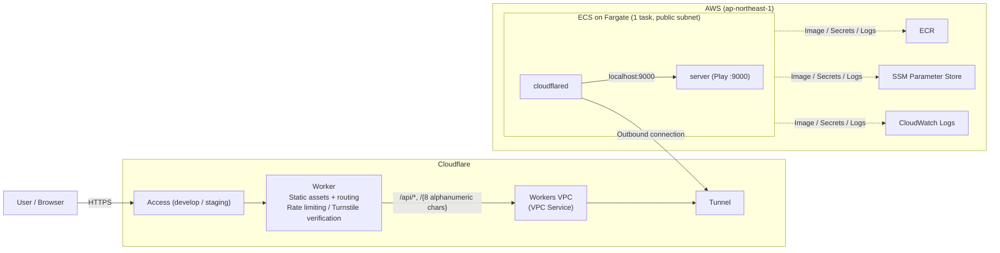

# Operational Prerequisites and Production Architecture (`docs/production-architecture.md`)

This document describes the prerequisites for running this service in production environments, infrastructure architecture on AWS / Cloudflare, CI/CD, and daily operational procedures.

> **This service is suspended (2026-09-25).** Every step under "Tearing Down Environments (Destroy)" below has been done: the three environments, `infra/terraform/github` (Environments and secrets), `infra/terraform/shared` (ECR, CI IAM, GitHub OIDC) and `infra/terraform/bootstrap` (state bucket) are all destroyed. Only the GitHub rulesets that protect `main` / `develop` and `v*` tags are kept; they were removed from Terraform state with `terraform state rm`, so they still exist on GitHub. The `deploy` workflow is disabled on GitHub (`gh workflow disable deploy.yml`). This document is kept as a record of the architecture and as the procedure for recreating it: start again from `bootstrap`, and `terraform import` the two rulesets (`github_repository_ruleset.branches` / `.release_tags`) before applying `infra/terraform/github`.

## Table of Contents

- [Operational Prerequisites (Single-Process Constraint)](#operational-prerequisites-single-process-constraint)
- [Architecture](#architecture)
  - [Architecture Diagram](#architecture-diagram)
  - [Environments](#environments)
  - [Components and Responsibilities](#components-and-responsibilities)
  - [Protection Mechanisms for Public Writes](#protection-mechanisms-for-public-writes)
- [Code Organization](#code-organization)
- [CI / CD](#ci--cd)
- [Operational Procedures](#operational-procedures)
  - [Release](#release)
  - [Verifying Deployed Environments (E2E)](#verifying-deployed-environments-e2e)
  - [Deploying Manually](#deploying-manually)
  - [Suspending When Unused](#suspending-when-unused)
  - [Tearing Down Environments (Destroy)](#tearing-down-environments-destroy)
  - [Credentials](#credentials)

---

## Operational Prerequisites (Single-Process Constraint)

Based on requirements, this service holds all short link mapping data in the server's **in-memory (`TrieMap`)**. No persistence to external databases is performed.

1. **Single-process operation is mandatory**: If distributed across multiple instances, short URLs created on one instance result in 404s on another, and different codes are returned for the same URL on different instances. Therefore, ECS tasks are always 1 (`desiredCount = 1`, and deploys do not run old and new side-by-side with `maximumPercent = 100` / `minimumHealthyPercent = 0`).
2. **Data is lost on restart**: On every deploy or task replacement, previously created short links disappear. The UI also warns that "service may end without notice, and short URLs may disappear at any time".
3. **Maximum link count limit**: To prevent running out of memory from public write APIs, a storage count limit is set (`SHORTENER_MAX_LINKS`, default 100,000). Once the limit is reached, new shorten requests are rejected with 503 `storage_full` (already registered URLs are still returned).

To scale across multiple instances, replace `domain.ShortLinkRepository` with a shared store implementation (such as DynamoDB) and change bindings in `Module.scala`. Upper use cases and controllers remain unchanged.

---

## Architecture

### Architecture Diagram



- The only entry point visible to users is Cloudflare. There are no entry points (load balancers or open ports) on AWS. Task security groups have no ingress; `cloudflared` establishes an outbound tunnel to Cloudflare.
- Tasks reside in a public subnet with a public IP assigned, accessing ECR / SSM / CloudWatch Logs / Cloudflare without NAT.
- Originally designed with CloudFront → internal NLB (VPC Origin) → ECS Managed Instances, but new account restrictions blocked ELB and CloudFront creation, and EC2 on-demand vCPU quota was 1; thus transitioned to the current architecture (Cloudflare Worker + Tunnel + Fargate). To revert to the original setup, request removal of ELB/CloudFront restrictions via AWS Support and vCPU quota increases via Service Quotas.

### Environments

| Environment | URL | Trigger | Cloudflare Access | Turnstile |
| --- | --- | --- | --- | --- |
| develop | `https://s-dev.u-na-gi.com` | push to `develop` branch | Yes | No |
| staging | `https://s-stg.u-na-gi.com` | push to `main` branch | Yes | Yes |
| prod | `https://s.u-na-gi.com` | `v*` tag (Requires owner approval) | None (Public) | Yes |

All three environments are in the same AWS and Cloudflare accounts, distinguished by resource name prefix (`short-link-<env>`) and Terraform state key.

### Components and Responsibilities

1. **Cloudflare Worker** (`src/front/worker/`, configuration in `src/front/wrangler.jsonc`):
   - Serves static assets built by `vite build` on the front.
   - Routes `/api/*` and short URLs (`/{8 alphanumeric chars}`) to the VPC Service in Workers VPC. Requests forwarded to Play strip Cookies, Access JWTs, and user `X-Forwarded-For`, passing the original host via `X-Forwarded-Host`. 302 redirects are returned as-is without following.
   - When unable to connect to the Tunnel (e.g. during task replacement), returns 502 `server_unavailable` instead of Cloudflare error pages.
2. **Workers VPC / Cloudflare Tunnel**: Network path from Worker to ECS task. VPC Service destination is `127.0.0.1:9000`, received by `cloudflared` which shares network namespace with Play inside the task.
3. **ECS on Fargate**: Task consists of two containers: `server` (Play, `src/server/Dockerfile.prod`) and `cloudflared`. `cloudflared` starts only after `server` passes health check (`/api/v1/health`).
4. **SSM Parameter Store**: Stores Play secret key (`PLAY_HTTP_SECRET_KEY`), Tunnel token, and Access service token for E2E as SecureStrings. Values created by Terraform and injected by ECS.
5. **ECR**: Server image. Single repository shared across all environments, tagged with commit SHA. Images used in prod receive additional `release-<sha>` tag, preserved by lifecycle rules (retains newest 30 tagged images).

### Protection Mechanisms for Public Writes

| Protection | Target | Mechanism |
| --- | --- | --- |
| DDoS Defense / Bot Fight Mode | All environments | Cloudflare default features |
| Cloudflare Access | develop / staging | Only permitted email addresses can log in via one-time code. E2E passes via service token |
| Turnstile | Shorten and resolve on staging / prod | Front submits widget token, Worker verifies via siteverify (matching action and hostname). Not applied to redirects |
| Rate Limiting | API and short URLs across all environments | Workers Rate Limiting (20 API calls/min, 100 redirects/min per IP). Approximate per-datacenter counting; not relied upon as a strict limit |
| Link Count Limit | All environments | Up to 100,000 links on application side (as above) |

---

## Code Organization

| Location | Contents | Applied By |
| --- | --- | --- |
| `infra/terraform/bootstrap` | S3 bucket for Terraform state | Locally (initial setup only) |
| `infra/terraform/shared` | ECR, GitHub Actions OIDC and roles, permission boundaries for environment roles | Locally |
| `infra/terraform/github` | GitHub Environments, secrets, rulesets (`modules/github`) | Locally (prevents CI from modifying its own permissions) |
| `infra/terraform/envs/{develop,staging,prod}` | Per-environment AWS (`modules/aws`) and Cloudflare (`modules/cloudflare`) | CI (`deploy.yml`). Can also be run locally |
| `infra/ecspresso` | ECS services and task definitions. ARNs read from Terraform state | CI. Can also be run locally |
| `src/front/wrangler.jsonc` | Per-environment Worker configuration. VPC Service ID and hostname verified against Terraform outputs before deploying | CI (`make deploy-front`). Can also be run locally |

---

## CI / CD

Three GitHub Actions workflows:

- **`ci.yml`** (Called on PR and before deploy): gitleaks, actionlint, server tests, front typecheck/test/build, E2E scenario formatting, Terraform fmt/validate/tflint, local E2E (compose).
- **`plan.yml`** (PR): `terraform plan` for `shared` and all 3 environments. Uses read-only role, outputs results only to logs (no PR comments since public repo).
- **`deploy.yml`** (push to develop / main, `v*` tags): CI → image (built if missing; prod does not build, uses image from main) → `terraform apply` → `ecspresso deploy` → Worker deploy.

AWS access via GitHub OIDC. Roles restrict assume-role origins per GitHub Environment, with permission boundaries attached to environment roles so CI cannot grant powerful permissions to itself or environment roles. See comments in `infra/terraform/shared/ci.tf` for details.

> [!NOTE]
> E2E against deployed environments is not run in CI. GitHub runners originate from datacenter IPs, which are blocked before Access by `u-na-gi.com` Bot Fight Mode (403, `cf-mitigated: challenge`). Run E2E manually from your local machine.

---

## Operational Procedures

The following steps are executed at the repository root from within the devcontainer. AWS uses SSO profile `short-link-develop` (`aws sso login --profile short-link-develop`), Cloudflare uses credentials in `infra/.envrc.local`.

### Release

1. Open PR from feature branch to `develop` and merge → deployed to develop.
2. Open PR from `develop` to `main` and merge → deployed to staging.
3. After verifying staging, create and push `v*` tag on main commit (`git tag -a v0.2.0 origin/main -m ... && git push origin v0.2.0`).
4. Approve deploy to `prod` in Actions UI ("Review deployments").

Only commits on main can be deployed to prod. Staging deploy for that commit must complete before tagging (stops if image is missing).

### Verifying Deployed Environments (E2E)

```sh
make e2e-remote ENV=develop   # Same for staging / prod
```

Sends one initial health check, outputting status and Cloudflare evaluation as `preflight:`. Due to Worker rate limits, wait 1 minute before subsequent runs.
develop verifies feature scenarios; staging / prod with Turnstile verify that tokenless writes are rejected with 403 (Turnstile verifies human interaction and cannot be passed programmatically).

### Deploying Manually

When CI is unavailable or for testing, the same can be run manually:

```sh
cd infra && set -a && . ./.envrc.local && set +a && export AWS_PROFILE=short-link-develop
terraform -chdir=terraform/envs/develop apply
ENV=develop IMAGE_TAG=<ECR tag> ecspresso deploy --config ecspresso/ecspresso.yml
cd .. && make deploy-front ENV=develop
```

When pushing images manually, use `docker build --provenance=false --sbom=false -f src/server/Dockerfile.prod ...` (otherwise artifacts disappear under ECR lifecycle rules; see comments in `Dockerfile.prod`).

### Suspending When Unused

Fargate tasks are billed only while running.

```sh
ENV=develop IMAGE_TAG=<current tag> ecspresso scale --config infra/ecspresso/ecspresso.yml --tasks 0   # Suspend
ENV=develop IMAGE_TAG=<current tag> ecspresso scale --config infra/ecspresso/ecspresso.yml --tasks 1   # Resume
```

While suspended, Worker returns 502 `server_unavailable` for API requests, while the UI continues to render. Restores to 1 task on next deploy.

### Tearing Down Environments (Destroy)

Follow the sequence strictly. If `cloudflared` remains connected, Tunnel cannot be deleted; if tasks remain, ECS cluster cannot be deleted.

1. Delete ECS service: `ENV=<env> IMAGE_TAG=<current tag> ecspresso delete --config infra/ecspresso/ecspresso.yml --force`
2. Delete Worker: `cd src/front && bunx wrangler delete --env <env>` (also detaches custom domain routing)
3. Delete via Terraform: `terraform -chdir=infra/terraform/envs/<env> destroy` (after loading `infra/.envrc.local`)
4. When decommissioning entirely, after deleting all 3 environments, destroy in order: `infra/terraform/github` → `infra/terraform/shared`. For `shared`, delete images in ECR first. Delete `bootstrap` (state bucket) last after removing `prevent_destroy` (migrate own state back to local first via `terraform init -migrate-state`). To keep the branch and tag protection on GitHub, run `terraform state rm github_repository_ruleset.branches github_repository_ruleset.release_tags` before destroying `infra/terraform/github`. The state bucket is versioned, so delete every object version and delete marker before destroying it.

### Credentials

| What | Where Located | Usage |
| --- | --- | --- |
| AWS (local) | `~/.aws` SSO profile `short-link-develop` | Terraform / ecspresso / aws cli |
| Cloudflare API token (local) | `CLOUDFLARE_API_TOKEN` in `infra/.envrc.local` | Terraform / wrangler |
| Cloudflare API token (CI) | GitHub Environment secrets (deploy and plan) | CI. Applied manually from `infra/terraform/github` |
| Allowed emails for Access | `TF_VAR_access_allowed_email` in `infra/.envrc.local` | Access for develop / staging |

When Cloudflare token permissions change, it may take a few minutes to take effect. Since the repository is public, never commit account IDs, emails, or tokens (also detected by CI gitleaks).
