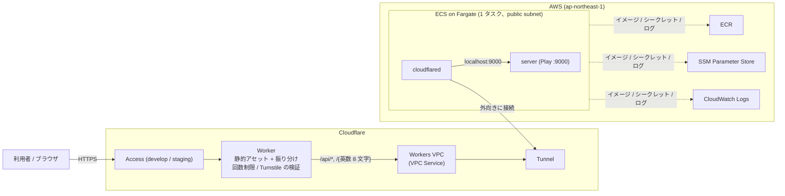

# 運用の前提と本番アーキテクチャ (`docs/production-architecture.md`)

本サービスを実環境で稼働させるための前提条件と、AWS / Cloudflare 上のインフラ構成、CI / CD、日々の運用手順を説明します。

> **このサービスは停止しています (2026-09-25)。** 3 環境とも、下の「環境を消す (destroy)」の 1〜3 (ECS の service、Worker、`envs/<env>` の Terraform) を済ませました。`shared` (ECR・CI 用 IAM)、`github`、`bootstrap` (state のバケット) は残してあります。この文書は稼働していたときの構成と、作り直すときの手順として残しています。

## 目次

- [運用の前提条件 (単一プロセス制約)](#運用の前提条件-単一プロセス制約)
- [構成](#構成)
  - [構成図](#構成図)
  - [環境](#環境)
  - [構成要素と責務](#構成要素と責務)
  - [公開の書き込みを守る仕組み](#公開の書き込みを守る仕組み)
- [コードの置き場所](#コードの置き場所)
- [CI / CD](#ci--cd)
- [運用手順](#運用手順)
  - [リリース](#リリース)
  - [デプロイ済みの環境を確かめる (E2E)](#デプロイ済みの環境を確かめる-e2e)
  - [手元からデプロイする](#手元からデプロイする)
  - [使わない間に止める](#使わない間に止める)
  - [環境を消す (destroy)](#環境を消す-destroy)
  - [認証情報](#認証情報)

---

## 運用の前提条件 (単一プロセス制約)

本サービスは要件に基づき、短縮リンクの対応データをすべてサーバ内の**インメモリ (`TrieMap`)** で保持しています。外部データベースへの永続化は行っていません。

1. **単一プロセスでの稼働が必須**: 複数台に振り分けると、ある台で作った短縮 URL が別の台では 404 になり、同じ URL に台ごとに別のコードが返ります。そのため ECS のタスクは常に 1 つです (`desiredCount = 1`、デプロイも `maximumPercent = 100` / `minimumHealthyPercent = 0` で新旧を並べない)。
2. **再起動でデータが消える**: デプロイやタスクの入れ替えのたびに、それまでの短縮リンクは消えます。画面にも「予告なく終了し、短縮 URL もいつ消えるか分からない」旨を出しています。
3. **件数の上限**: 公開の書き込み API でメモリを使い切られないよう、保存件数に上限 (`SHORTENER_MAX_LINKS`、既定 10 万件) を設けています。上限に達すると新しい短縮は 503 `storage_full` で断ります (登録済みの URL は返します)。

複数台にスケールする場合は、`domain.ShortLinkRepository` を共有ストア (DynamoDB など) の実装に差し替え、`Module.scala` のバインディングを変えます。上位のユースケースやコントローラは変わりません。

---

## 構成

### 構成図



- 利用者から見える入口は Cloudflare だけです。AWS 側には入口 (ロードバランサーや開いたポート) がありません。タスクのセキュリティグループは ingress なしで、`cloudflared` が Cloudflare に外向きに Tunnel を張ります。
- タスクは public subnet に置いてパブリック IP を付け、ECR / SSM / CloudWatch Logs / Cloudflare へは NAT を使わずに出ます。
- 最初は CloudFront → 内部 NLB (VPC Origin) → ECS Managed Instances の構成でしたが、新規アカウントの制限で ELB と CloudFront の作成が拒否され、EC2 のオンデマンドの vCPU 上限も 1 だったため、今の形 (Cloudflare Worker + Tunnel + Fargate) に切り替えました。元の構成に戻すには、AWS サポートに ELB / CloudFront の解除を、Service Quotas に vCPU 上限の引き上げを依頼します。

### 環境

| 環境    | URL                         | 出すきっかけ                      | Cloudflare Access | Turnstile |
| ------- | --------------------------- | --------------------------------- | ----------------- | --------- |
| develop | `https://s-dev.u-na-gi.com` | `develop` ブランチへの push       | あり              | なし      |
| staging | `https://s-stg.u-na-gi.com` | `main` ブランチへの push          | あり              | あり      |
| prod    | `https://s.u-na-gi.com`     | `v*` タグ (オーナーの承認が必要) | なし (公開)       | あり      |

3 環境とも同じ AWS アカウント・Cloudflare アカウントにあり、リソース名の接頭辞 (`short-link-<env>`) と Terraform の state の key で分けています。

### 構成要素と責務

1. **Cloudflare Worker** (`src/front/worker/`、設定は `src/front/wrangler.jsonc`)
   - `vite build` した front の静的アセットを配ります。
   - `/api/*` と短縮 URL (`/{英数 8 文字}`) を Workers VPC の VPC Service に流します。Play へのリクエストでは Cookie・Access の JWT・利用者の `X-Forwarded-For` を落とし、元のホストを `X-Forwarded-Host` で渡します。リダイレクトは追わずに 302 をそのまま返します。
   - Tunnel に繋がらないとき (タスクの入れ替え中など) は、Cloudflare のエラーページではなく 502 `server_unavailable` を返します。
2. **Workers VPC / Cloudflare Tunnel**: Worker から ECS のタスクへの経路です。VPC Service の宛先は `127.0.0.1:9000` で、タスク内で Play とネットワーク名前空間を共有する `cloudflared` が受けます。
3. **ECS on Fargate**: タスクは `server` (Play、`src/server/Dockerfile.prod`) と `cloudflared` の 2 コンテナです。`cloudflared` は `server` のヘルスチェック (`/api/v1/health`) が通ってから起動します。
4. **SSM Parameter Store**: Play の秘密鍵 (`PLAY_HTTP_SECRET_KEY`)、Tunnel のトークン、E2E 用の Access サービストークンを SecureString で持ちます。値は Terraform が作り、タスクには ECS が注入します。
5. **ECR**: server のイメージ。1 つのリポジトリを全環境で使い、コミットの sha でタグを付けます。prod で使ったイメージには `release-<sha>` を足し、ライフサイクルルール (タグ付きは新しい 30 個だけ残す) で消えないようにしています。

### 公開の書き込みを守る仕組み

| 守り                          | 対象                                   | 仕組み                                                                                                                       |
| ----------------------------- | -------------------------------------- | ---------------------------------------------------------------------------------------------------------------------------- |
| DDoS 防御 / Bot Fight Mode    | 全環境                                 | Cloudflare の既定の機能                                                                                                      |
| Cloudflare Access             | develop / staging                      | 許可したメールアドレスだけワンタイムコードでログインできる。E2E はサービストークンで通る                                    |
| Turnstile                     | staging / prod の短縮と復元            | front がウィジェットのトークンを送り、Worker が siteverify で検証する (action とホスト名も照合)。リダイレクトにはかけない |
| 回数制限                      | 全環境の API と短縮 URL                | Workers Rate Limiting (IP ごとに API 20 回 / 分、リダイレクト 100 回 / 分)。データセンターごとのゆるい数え方で、厳密な制限としては当てにしない |
| 件数の上限                    | 全環境                                 | アプリ側で 10 万件まで (上記)                                                                                               |

---

## コードの置き場所

| 場所                                        | 中身                                                                                                                 | 誰が適用するか                          |
| ------------------------------------------- | -------------------------------------------------------------------------------------------------------------------- | --------------------------------------- |
| `infra/terraform/bootstrap`                 | Terraform の state を置く S3 バケット                                                                               | 手元 (最初の 1 回)                      |
| `infra/terraform/shared`                    | ECR、GitHub Actions の OIDC とロール、環境のロールの権限境界                                                        | 手元                                    |
| `infra/terraform/github`                    | GitHub の Environment・シークレット・ルールセット (`modules/github`)                                                | 手元 (CI に自分の権限を書き換えさせない) |
| `infra/terraform/envs/{develop,staging,prod}` | 環境ごとの AWS (`modules/aws`) と Cloudflare (`modules/cloudflare`)                                                | CI (`deploy.yml`)。手元からもできる     |
| `infra/ecspresso`                           | ECS の service とタスク定義。ARN などは Terraform の state から読む                                                  | CI。手元からもできる                    |
| `src/front/wrangler.jsonc`                  | Worker の環境ごとの設定。VPC Service の ID とホスト名は Terraform の output と突き合わせてから deploy する           | CI (`make deploy-front`)。手元からもできる |

---

## CI / CD

GitHub Actions のワークフローは 3 つです。

- **`ci.yml`** (PR と、deploy の前に呼ばれる): gitleaks、actionlint、server のテスト、front の型・テスト・ビルド、E2E シナリオの整形、Terraform の fmt / validate / tflint、ローカルの E2E (compose)。
- **`plan.yml`** (PR): `shared` と 3 環境の `terraform plan`。読み取り専用のロールで、結果はログにだけ出します (公開リポジトリなので PR にはコメントしない)。
- **`deploy.yml`** (develop / main への push、`v*` タグ): CI → イメージ (無ければビルド。prod はビルドせず main のイメージを使う) → `terraform apply` → `ecspresso deploy` → Worker の deploy。

AWS には GitHub の OIDC で入ります。ロールは GitHub の Environment ごとに引き受け元を絞り、CI が自分や環境のロールに強い権限を付けられないよう、環境のロールには権限境界を付けています。詳しくは `infra/terraform/shared/ci.tf` のコメントを参照してください。

> [!NOTE]
> デプロイ済みの環境への E2E は CI では流しません。GitHub のランナーはデータセンターの IP から来るので、`u-na-gi.com` の Bot Fight Mode に Access より手前で止められるためです (403、`cf-mitigated: challenge`)。E2E は手元から流します。

---

## 運用手順

以下はリポジトリのルートで、devcontainer の中から実行します。AWS は SSO のプロファイル `short-link-develop` (`aws sso login --profile short-link-develop`)、Cloudflare は `infra/.envrc.local` の認証情報を使います。

### リリース

1. 機能ブランチから `develop` に PR を出して merge する → develop に deploy される。
2. `develop` から `main` に PR を出して merge する → staging に deploy される。
3. staging を確かめたら、main のコミットに `v*` タグを切って push する (`git tag -a v0.2.0 origin/main -m ... && git push origin v0.2.0`)。
4. Actions の画面で `prod` の deploy を承認する ("Review deployments")。

prod には main に入っているコミットしか出せません。タグを切る前に、そのコミットの staging への deploy が終わっている必要があります (イメージが無いと止まる)。

### デプロイ済みの環境を確かめる (E2E)

```sh
make e2e-remote ENV=develop   # staging / prod も同じ
```

最初にヘルスチェックを 1 回叩き、ステータスと Cloudflare の判定を `preflight:` として出します。Worker の回数制限があるので、続けて流すときは 1 分空けてください。
develop では機能のシナリオを、Turnstile のある staging / prod ではトークンの無い書き込みが 403 で断られることを確かめます (Turnstile は人の操作を確かめる仕組みなので、機械からは通せない)。

### 手元からデプロイする

CI が使えないときや、試したいときは手元からも同じことができます。

```sh
cd infra && set -a && . ./.envrc.local && set +a && export AWS_PROFILE=short-link-develop
terraform -chdir=terraform/envs/develop apply
ENV=develop IMAGE_TAG=<ECR のタグ> ecspresso deploy --config ecspresso/ecspresso.yml
cd .. && make deploy-front ENV=develop
```

イメージを手元から push するときは `docker build --provenance=false --sbom=false -f src/server/Dockerfile.prod ...` にします (付けないと ECR のライフサイクルで実体が消える。`Dockerfile.prod` のコメント参照)。

### 使わない間に止める

Fargate のタスクは動いている間だけ課金されます。

```sh
ENV=develop IMAGE_TAG=<今のタグ> ecspresso scale --config infra/ecspresso/ecspresso.yml --tasks 0   # 止める
ENV=develop IMAGE_TAG=<今のタグ> ecspresso scale --config infra/ecspresso/ecspresso.yml --tasks 1   # 戻す
```

止めている間、API は Worker が 502 `server_unavailable` を返し、画面は表示されます。次の deploy でも 1 台に戻ります。

### 環境を消す (destroy)

順番を守ってください。`cloudflared` が繋がったままだと Tunnel を消せず、タスクが残っていると ECS のクラスタを消せません。

1. ECS の service を消す: `ENV=<env> IMAGE_TAG=<今のタグ> ecspresso delete --config infra/ecspresso/ecspresso.yml --force`
2. Worker を消す: `cd src/front && bunx wrangler delete --env <env>` (カスタムドメインの割り当ても外れる)
3. Terraform で消す: `terraform -chdir=infra/terraform/envs/<env> destroy` (`infra/.envrc.local` を読み込んでから)
4. 全部やめるときは、3 環境を消したあとに `infra/terraform/github` → `infra/terraform/shared` の順に destroy する。`shared` の ECR は中のイメージを先に消す。`bootstrap` (state のバケット) は `prevent_destroy` を外してから最後に消す (自分の state もこのバケットにあるので、先にローカルへ `terraform init -migrate-state` で戻す)

### 認証情報

| 何                                 | どこにあるか                                              | 使い道                                                   |
| ---------------------------------- | --------------------------------------------------------- | -------------------------------------------------------- |
| AWS (手元)                         | `~/.aws` の SSO プロファイル `short-link-develop`          | Terraform / ecspresso / aws cli                          |
| Cloudflare API トークン (手元)     | `infra/.envrc.local` の `CLOUDFLARE_API_TOKEN`            | Terraform / wrangler                                     |
| Cloudflare API トークン (CI)       | GitHub の Environment のシークレット (deploy 用と plan 用) | CI。値は `infra/terraform/github` を手元から apply して入れる |
| Access で許可するメールアドレス    | `infra/.envrc.local` の `TF_VAR_access_allowed_email`     | develop / staging の Access                              |

Cloudflare のトークンの権限を変えたときは、効くまで数分かかることがあります。リポジトリは公開なので、アカウント ID・メールアドレス・トークンはコミットしないでください (CI の gitleaks でも検出します)。
