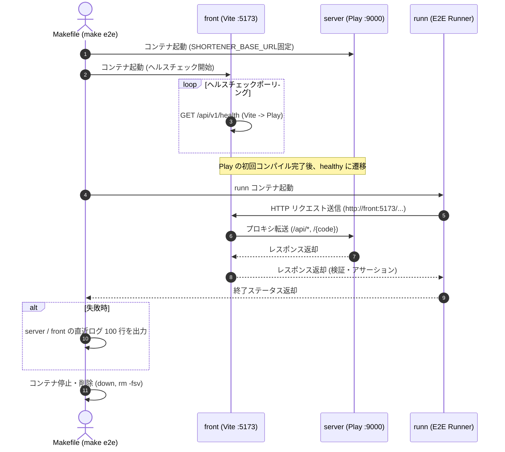

# E2E シナリオテスト (`tests/`)

実際に起動したサービス群（フロントエンド + API サーバ）に対して外部から HTTP リクエストを送信し、結合状態での振る舞いを検証するエンドツーエンド（E2E）テストです。[runn](https://github.com/k1LoW/runn) (YAML 形式のシナリオテスティングツール) を採用しています。

## 目次

- [テスト方針と棲み分け](#テスト方針と棲み分け)
- [実行方法](#実行方法)
- [E2E 実行環境の仕組み (`compose.e2e.yaml`)](#e2e-実行環境の仕組み-composee2eyaml)
- [シナリオ一覧とテスト内容](#シナリオ一覧とテスト内容)
- [環境変数](#環境変数)
- [シナリオの追加とツール管理](#シナリオの追加とツール管理)

---

## テスト方針と棲み分け

本リポジトリでは、すべてのパターンを E2E で網羅するのではなく、各テストレイヤの責務を明確に分けています。

| テストレイヤ                 | 配置場所           | 実行ツール | 主な検証対象                                                                                                                                                                                           |
| ---------------------------- | ------------------ | ---------- | ------------------------------------------------------------------------------------------------------------------------------------------------------------------------------------------------------ |
| **ユニット / 統合テスト**    | `src/server/test/` | ScalaTest  | アプリケーションをインプロセスで起動し、ドメインのバリデーション規則、URL の正規化、ルーティング、JSON シリアライズ/デシリアライズ、コード採番の衝突リトライなど、境界値や内部ロジックを網羅的に検証。 |
| **フロントエンド単体テスト** | `src/front/`       | Bun Test   | 送信前 URL 簡易バリデーション (`url.test.ts`)。                                                                                                                                                        |
| **E2E シナリオテスト**       | ここ (`tests/`)    | runn       | 実際にプロセスとして立ち上がったフロントエンド（Vite リバースプロキシ）およびバックエンド（Play Framework）に対し、外部クライアント視点での結合・疎通・ルーティングの振る舞いを検証。                  |

> [!NOTE]
> E2E テストの目的は詳細な業務ルールの二重チェックではなく、「各コンポーネントが正しく連携し、実際にリクエストを受け付けて仕様どおりに応答できるか」を担保することにあります。

---

## 実行方法

### 基本の実行コマンド

リポジトリルートで以下のコマンドを実行します。

```sh
# E2E テストの実行 (専用 Compose の起動から片付けまで全自動)
make e2e

# 成功したステップも含め、すべての HTTP 送受信ログを出力
make e2e E2E_ARGS="--debug"

# 特定のラベルのシナリオのみを実行 (例: smoke)
make e2e E2E_ARGS="--label smoke"
```

### シナリオ一覧の確認と構文チェック

Devcontainer 内部またはホストマシン上に `runn` がインストールされている場合、以下のコマンドで構文チェックとシナリオ一覧の確認ができます。

```sh
# 構文チェックとステップ一覧表示
runn list -l "tests/scenarios/*.yml" </dev/null
```

> [!WARNING]
> `runn list` をターミナルから対話なしで実行する場合、標準入力を閉じないとプロンプト入力待ちになり処理が進まなくなるため、必ず末尾に `</dev/null` を付与してください。

### コード品質・フォーマットコマンド

`tests/` ディレクトリ内には YAML ファイルや TypeScript 型定義のための環境が用意されています。

```sh
cd tests

# oxlint による静的解析
bun run lint

# Prettier によるコード整形
bun run format

# Prettier のフォーマットチェック
bun run format:check
```

---

## E2E 実行環境の仕組み (`compose.e2e.yaml`)

`make e2e` は、開発用の `compose.yaml` に `compose.e2e.yaml` を重ね、独立したプロジェクト名 `short-link-e2e` として起動します。



### 主な特徴と設計意図

1. **開発環境 (`make up`) との完全な分離**:
   - `compose.e2e.yaml` 内で `ports: !reset []` を指定し、ホストへのポート公開を無効化しています。そのため、手元で `make up` が動いている最中でもポートの競合を起こさずに E2E を並行実行できます。
   - インメモリのデータ保持領域およびコンパイル成果物 (`server-target`) もプロジェクトごとに分離されています。
2. **キャッシュ共有による高速化**:
   - sbt および coursier のキャッシュボリュームのみ、開発用の名前付きボリューム (`short-link-service_sbt-cache` / `coursier-cache`) を共有するように定義し、テストのたびに依存ライブラリを再ダウンロードする無駄を省いています。
3. **ブラウザと同じ経路での検証**:
   - runn は API サーバ (`server:9000`) に直接リクエストを送るのではなく、フロントエンド (`http://front:5173`) に対してリクエストを送ります。Vite のリバースプロキシ設定も含めて本番同等の通信経路を検証します。
4. **自動クリーンアップとログ出力**:
   - テスト完了後は合否に関わらず自動的にコンテナと匿名ボリュームが破棄されます。
   - シナリオが 1 つでも失敗した場合は、破棄直前に `server` と `front` の末尾 100 行のログを自動的にターミナルへ出力するため、原因究明が容易です。
5. **固定の環境変数**:
   - 実行者のローカルの `.env` の内容に左右されないよう、server の環境変数 `SHORTENER_BASE_URL` は `https://example.com` に固定されています。

---

## シナリオ一覧とテスト内容

`tests/scenarios/` に配置されている YAML ファイルと、各シナリオの検証内容は以下の通りです（現在 4 シナリオ、全 16 ステップ）。

### 1. `health.yml`

- **ラベル**: `smoke`
- **内容**:
  - `GET /api/v1/health` にリクエストを送信し、ステータス `200` および `{"status":"ok"}` が返ることを確認。
  - フロントエンド経由でバックエンドまで正しく疎通していることの最小限の確認。

### 2. `create_link.yml`

- **ラベル**: `links`
- **内容**:
  - `POST /api/v1/links` に正常な URL を送信し、ステータス `201 Created` が返ること。
  - レスポンスの `code` が英数字 8 文字であること、`shortUrl` が指定ドメインとコードで構成されていること。
  - **同一 URL の同一コード返却**: 同じ元 URL を再度 POST した場合に、新しいコードが採番されず、全く同一の `code` が返却されること。

### 3. `create_link_validation.yml`

- **ラベル**: `links`, `validation`
- **内容**:
  - 不正なリクエストに対して適切な 400 番台エラーが返ることの検証。
  - `url` プロパティの欠落、数値など文字列以外の入力 → 400 `invalid_request`
  - 空文字、ユーザー認証情報付き URL (`user:pass@host`)、非対応スキーム (`ftp://`) → 400 `invalid_url` (`reason` 付き)
  - 自サービス自身の URL を短縮しようとした場合 → 400 `self_reference` (リダイレクトループ防止)

### 4. `resolve_link.yml`

- **ラベル**: `links`
- **内容**:
  - **短縮リンクのリダイレクト (`GET /{code}`)**:
    - 発行済みコードへのアクセスでステータス `302 Found` となり、`Location` ヘッダに元 URL が設定されること（リダイレクトを自動追従せずにヘッダを検証）。
    - 存在しない未発行コードへのアクセスで `404 Not Found` が返ること。
  - **短縮 URL の復元 API (`GET /api/v1/links/resolve?shortUrl=...`)**:
    - 発行済みの短縮 URL 全体をクエリに渡すと、ステータス `200` で元 URL を含む情報が返ること。
    - 存在しない短縮 URL を渡すと、`404 Not Found` (`not_found`) が返ること。
    - 自サービスのドメインや形式と異なる URL を渡すと、`400 Bad Request` (`not_short_url`) が返ること。
    - クエリパラメータが空の場合、`400 Bad Request` (`invalid_request`) が返ること。

---

## 環境変数

シナリオ内で参照される環境変数です。`compose.e2e.yaml` の `runn` サービスで注入されています。

| 環境変数名                | デフォルト値                     | Compose での値                 | 説明                                                                                                           |
| ------------------------- | -------------------------------- | ------------------------------ | -------------------------------------------------------------------------------------------------------------- |
| `E2E_BASE_URL`            | `http://localhost:9000`          | `http://front:5173`            | テスト対象のベース URL。Compose では Vite プロキシ経由。                                                       |
| `E2E_SELF_URL`            | `http://localhost:9000/abcd1234` | `https://example.com/abcd1234` | 自己参照エラー検証用のダミー URL。API サーバの `SHORTENER_BASE_URL` とホスト名を一致させておく必要があります。 |
| `E2E_UNKNOWN_SHORT_URL`   | `https://example.com/zzzzzzzz`   | `https://example.com/zzzzzzzz` | 存在しない短縮 URL の復元検証用 URL。                                                                          |
| `CF_ACCESS_CLIENT_ID`     | (空)                             | (空)                           | Cloudflare Access のサービストークン。`make e2e-remote` が SSM から渡す。ローカルでは空で送られ、無視される。  |
| `CF_ACCESS_CLIENT_SECRET` | (空)                             | (空)                           | 同上のシークレット。                                                                                           |

### デプロイ済みの環境に流す (`make e2e-remote`)

develop / staging は Cloudflare Access で守られているので、サービストークンのヘッダ (`CF-Access-Client-Id` / `CF-Access-Client-Secret`) を付けて流します。
各シナリオの `vars.access` に YAML のアンカーとして定義し、すべてのステップの `headers` で参照しています。シナリオを足すときも、ステップに `headers: *access` (ほかのヘッダと並べるなら `<<: *access`) を付けてください。

```sh
make e2e-remote ENV=develop
```

- 向き先は `infra/terraform/envs/<ENV>` の output `public_base_url`、`E2E_SELF_URL` / `E2E_UNKNOWN_SHORT_URL` は output `shortener_base_url` (develop は `https://example.com`) から作り、トークンは SSM (`/short-link-<ENV>/e2e/access-client-{id,secret}`) から読みます。
- Turnstile をかけた環境 (staging / prod) では `E2E_TURNSTILE=on` を渡し、短縮・復元のシナリオ (`if: env.E2E_TURNSTILE != 'on'`) を飛ばして、トークンの無いリクエストが 403 `turnstile_failed` で断られることを `turnstile.yml` で確かめます。Turnstile は人の操作を確かめる仕組みなので、runn からは通せません。機能の E2E は、Turnstile をかけない develop で流します。
- prod は Cloudflare Access をかけていないので、サービストークンは読まずに流します。
- Worker の回数制限 (API は IP ごとに 1 分 20 回) があるので、続けて流すときは 1 分空けてください。
- `--debug` はリクエストヘッダ (トークンのシークレット) をそのまま出力します。調べるときだけ手元で使い、出力を残さないでください。

---

## シナリオの追加とツール管理

### runn のバージョン管理

- runn の実行イメージは `compose.e2e.yaml` 内で `ghcr.io/k1low/runn:v1.11.0` として指定されています。
- また、`.devcontainer/Dockerfile` 内にも同バージョンのバイナリが組み込まれています。
- **runn のバージョンをアップデートする場合は、上記 2 箇所のバージョン指定を必ず同時に更新してください。**

### 新規シナリオの追加手順

1. `tests/scenarios/` 配下に新しい `.yml` ファイルを作成します。
2. 以下のテンプレートに沿ってシナリオを記述します。

```yaml
desc: 新しい機能の検証シナリオ
runners:
  req: ${E2E_BASE_URL}
labels:
  - links
steps:
  step1:
    desc: POST リクエストの検証
    req:
      /api/v1/links:
        post:
          body:
            application/json:
              url: https://example.org/test
    test: |
      current.res.status == 201 &&
      current.res.body.code != ""
```

3. シナリオの構文チェックを行います。
   ```sh
   runn list -l "tests/scenarios/新しいシナリオ.yml" </dev/null
   ```
4. `make e2e` を実行してシナリオが正常にパスすることを確認します。
