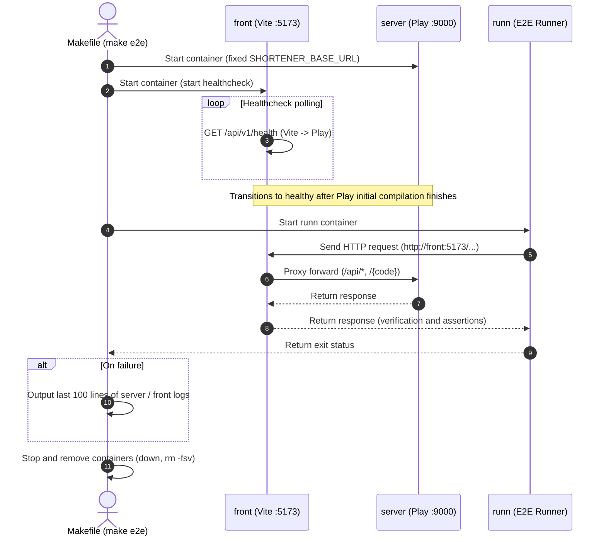

# E2E Scenario Tests (`tests/`)

End-to-end (E2E) tests that send HTTP requests externally to running services (frontend + API server) to verify integrated behavior. Uses [runn](https://github.com/k1LoW/runn) (YAML-based scenario testing tool).

## Table of Contents

- [Testing Policy and Separation of Concerns](#testing-policy-and-separation-of-concerns)
- [How to Run](#how-to-run)
  - [Basic Run Commands](#basic-run-commands)
  - [Listing Scenarios and Syntax Checking](#listing-scenarios-and-syntax-checking)
  - [Code Quality and Formatting Commands](#code-quality-and-formatting-commands)
- [How the E2E Environment Works (`compose.e2e.yaml`)](#how-the-e2e-environment-works-composee2eyaml)
  - [Key Features and Design Intent](#key-features-and-design-intent)
- [Scenarios and Test Coverage](#scenarios-and-test-coverage)
  - [1. `health.yml`](#1-healthyml)
  - [2. `create_link.yml`](#2-create_linkyml)
  - [3. `create_link_validation.yml`](#3-create_link_validationyml)
  - [4. `resolve_link.yml`](#4-resolve_linkyml)
- [Environment Variables](#environment-variables)
  - [Running Against Deployed Environments (`make e2e-remote`)](#running-against-deployed-environments-make-e2e-remote)
- [Adding Scenarios and Tool Management](#adding-scenarios-and-tool-management)
  - [runn Version Management](#runn-version-management)
  - [Procedure for Adding a New Scenario](#procedure-for-adding-a-new-scenario)

---

## Testing Policy and Separation of Concerns

Rather than covering all patterns in E2E, this repository clearly separates responsibilities across testing layers.

| Test Layer | Location | Tool | Primary Scope |
| --- | --- | --- | --- |
| **Unit / Integration Tests** | `src/server/test/` | ScalaTest | Starts application in-process, thoroughly testing boundary values and internal logic such as domain validation rules, URL normalization, routing, JSON serialization/deserialization, and code allocation collision retries. |
| **Frontend Unit Tests** | `src/front/` | Bun Test | Pre-submission lightweight URL validation (`url.test.ts`). |
| **E2E Scenario Tests** | Here (`tests/`) | runn | Verifies integrated behavior, connectivity, and routing from an external client perspective against running frontend (Vite reverse proxy) and backend (Play Framework) processes. |

> [!NOTE]
> The goal of E2E tests is not duplicate checking of detailed business rules, but guaranteeing that "each component interacts correctly, accepts requests, and responds per specifications in actual execution."

---

## How to Run

### Basic Run Commands

Run the following commands at the repository root.

```sh
# Run E2E tests (fully automated from starting dedicated Compose to cleanup)
make e2e

# Output all HTTP request/response logs, including successful steps
make e2e E2E_ARGS="--debug"

# Run only scenarios with specific labels (e.g., smoke)
make e2e E2E_ARGS="--label smoke"
```

### Listing Scenarios and Syntax Checking

When `runn` is installed inside the Devcontainer or on the host machine, check syntax and list scenarios with:

```sh
# Check syntax and list steps
runn list -l "tests/scenarios/*.yml" </dev/null
```

> [!WARNING]
> When executing `runn list` non-interactively from a terminal, always append `</dev/null`; otherwise it waits for prompt input and blocks execution.

### Code Quality and Formatting Commands

The `tests/` directory contains configurations for YAML files and TypeScript type definitions.

```sh
cd tests

# Static analysis with oxlint
bun run lint

# Code formatting with Prettier
bun run format

# Check formatting with Prettier
bun run format:check
```

---

## How the E2E Environment Works (`compose.e2e.yaml`)

`make e2e` overlays `compose.e2e.yaml` onto development `compose.yaml`, starting as an isolated project named `short-link-e2e`.



### Key Features and Design Intent

1. **Complete isolation from development environment (`make up`)**:
   - `compose.e2e.yaml` specifies `ports: !reset []`, disabling port publishing to the host. Thus E2E can run concurrently without port collisions even while `make up` is running locally.
   - In-memory data store and compilation artifacts (`server-target`) are also isolated per project.
2. **Acceleration via cache sharing**:
   - Shares development named volumes (`short-link-service_sbt-cache` / `coursier-cache`) for sbt and coursier caches only, avoiding wasteful re-downloading of dependency libraries on every test run.
3. **Verification via identical browser route**:
   - runn sends requests to the frontend (`http://front:5173`) rather than directly to the API server (`server:9000`). Tests production-equivalent communication paths including Vite reverse proxy configuration.
4. **Automatic cleanup and log output**:
   - After test completion, containers and anonymous volumes are automatically destroyed regardless of pass/fail.
   - If any scenario fails, the last 100 lines of `server` and `front` logs are automatically printed to the terminal right before cleanup, facilitating troubleshooting.
5. **Fixed environment variables**:
   - The server environment variable `SHORTENER_BASE_URL` is fixed to `https://example.com` to prevent influence by local `.env` contents.

---

## Scenarios and Test Coverage

YAML files in `tests/scenarios/` and their test coverage (currently 4 scenarios, 16 steps total):

### 1. `health.yml`

- **Label**: `smoke`
- **Coverage**:
  - Sends request to `GET /api/v1/health`, verifying status `200` and `{"status":"ok"}`.
  - Minimal verification of correct connectivity through frontend to backend.

### 2. `create_link.yml`

- **Label**: `links`
- **Coverage**:
  - Sends valid URL to `POST /api/v1/links`, verifying status `201 Created`.
  - Verifies response `code` is 8 alphanumeric characters and `shortUrl` consists of specified domain and code.
  - **Same code returned for same URL**: Verifies that re-POSTing the same original URL does not allocate a new code, returning the identical `code`.

### 3. `create_link_validation.yml`

- **Label**: `links`, `validation`
- **Coverage**:
  - Verifies appropriate 4xx errors are returned for invalid requests.
  - Missing `url` property, non-string inputs such as numbers → 400 `invalid_request`
  - Empty string, URL with user credentials (`user:pass@host`), unsupported scheme (`ftp://`) → 400 `invalid_url` (with `reason`)
  - Attempting to shorten this service's own URL → 400 `self_reference` (prevent redirect loops)

### 4. `resolve_link.yml`

- **Label**: `links`
- **Coverage**:
  - **Short link redirection (`GET /{code}`)**:
    - Visiting an issued code returns status `302 Found` with `Location` header set to original URL (verifies header without auto-following redirects).
    - Visiting a nonexistent unissued code returns `404 Not Found`.
  - **Short URL resolve API (`GET /api/v1/links/resolve?shortUrl=...`)**:
    - Passing an entire issued short URL in the query returns status `200` with information including original URL.
    - Passing a nonexistent short URL returns `404 Not Found` (`not_found`).
    - Passing a URL different from this service's domain or format returns `400 Bad Request` (`not_short_url`).
    - When query parameter is empty, returns `400 Bad Request` (`invalid_request`).

---

## Environment Variables

Environment variables referenced in scenarios, injected by the `runn` service in `compose.e2e.yaml`:

| Environment Variable | Default Value | Value in Compose | Description |
| --- | --- | --- | --- |
| `E2E_BASE_URL` | `http://localhost:9000` | `http://front:5173` | Target base URL. Via Vite proxy in Compose. |
| `E2E_SELF_URL` | `http://localhost:9000/abcd1234` | `https://example.com/abcd1234` | Dummy URL for verifying self-reference errors. Hostname must match API server's `SHORTENER_BASE_URL`. |
| `E2E_UNKNOWN_SHORT_URL` | `https://example.com/zzzzzzzz` | `https://example.com/zzzzzzzz` | URL for verifying resolution of nonexistent short URLs. |
| `CF_ACCESS_CLIENT_ID` | (Empty) | (Empty) | Cloudflare Access service token. Passed from SSM by `make e2e-remote`. Sent empty and ignored locally. |
| `CF_ACCESS_CLIENT_SECRET` | (Empty) | (Empty) | Secret for the above. |

### Running Against Deployed Environments (`make e2e-remote`)

Because develop / staging are protected by Cloudflare Access, run with service token headers (`CF-Access-Client-Id` / `CF-Access-Client-Secret`).
Defined as a YAML anchor in `vars.access` in each scenario, referenced in `headers` across all steps. When adding scenarios, attach `headers: *access` (or `<<: *access` alongside other headers) to steps.

```sh
make e2e-remote ENV=develop
```

- Target is `public_base_url` output from `infra/terraform/envs/<ENV>`, `E2E_SELF_URL` / `E2E_UNKNOWN_SHORT_URL` are created from `shortener_base_url` output (`https://example.com` for develop), and tokens are read from SSM (`/short-link-<ENV>/e2e/access-client-{id,secret}`).
- In Turnstile-enabled environments (staging / prod), pass `E2E_TURNSTILE=on` to skip shorten/resolve scenarios (`if: env.E2E_TURNSTILE != 'on'`) and verify that tokenless requests are rejected with 403 `turnstile_failed` via `turnstile.yml`. Turnstile verifies human interaction and cannot be passed from runn. Functional E2E is run on develop without Turnstile.
- prod does not use Cloudflare Access, so runs without reading service tokens.
- Due to Worker rate limiting (20 API calls/min per IP), wait 1 minute before subsequent runs.
- `--debug` outputs request headers (token secret) as-is. Use locally only when troubleshooting; do not leave logs behind.

---

## Adding Scenarios and Tool Management

### runn Version Management

- The runn execution image is specified in `compose.e2e.yaml` as `ghcr.io/k1low/runn:v1.11.0`.
- The same version binary is also built into `.devcontainer/Dockerfile`.
- **When updating the runn version, be sure to update the version specifications in both locations above simultaneously.**

### Procedure for Adding a New Scenario

1. Create a new `.yml` file under `tests/scenarios/`.
2. Write the scenario following the template below:

```yaml
desc: Scenario for verifying new features
runners:
  req: ${E2E_BASE_URL}
labels:
  - links
steps:
  step1:
    desc: Verify POST request
    req:
      /api/v1/links:
        post:
          body:
            application/json:
              url: https://example.org/test
    test: |
      current.res.status == 201 &&
      current.res.body.code != ""
```

3. Check scenario syntax:
   ```sh
   runn list -l "tests/scenarios/new_scenario.yml" </dev/null
   ```
4. Run `make e2e` and confirm that scenarios pass successfully.
